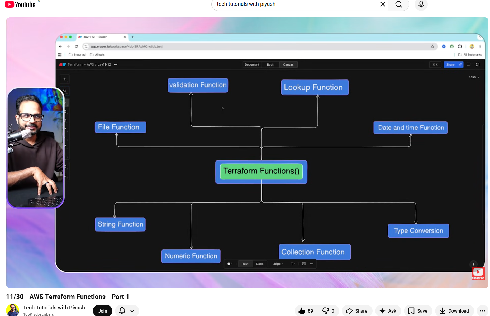
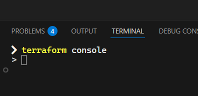

[11/30 - AWS Terraform Functions Part1](https://youtu.be/-dKsmU4Z1hM?si=HdC7-HNsF3Q2OKf-)
[12/30 - AWS Terraform Functions Part2](https://youtu.be/ZYCCu9rZkU8?si=_SBQJJ-YuIvTn-q8)
[Notes Repo](https://github.com/piyushsachdeva/Terraform-Full-Course-Aws/tree/main/lessons/day11-12)

[Functions - Configuration Language | Terraform](https://developer.hashicorp.com/terraform/language/functions)

[Built-in Functions](https://developer.hashicorp.com/terraform/language/functions)

> upper("Hello 30daysofawsterraform")
> "HELLO 30DAYSOFAWSTERRAFORM"  
> lower("HELLO 30DAYSOFAWSTERRAFORM")
> "hello 30daysofawsterraform"

> trim("?!Hello?!", "!?")
> "Hello"

 wsl .  
/bin/bash: line 1: .: filename argument required  
.: usage: . filename [arguments]  
 ubuntu run  
 WSL at  ♥ 13:00:47  CPU: 11.24% | RAM: 0/6GB    
  mnt/../../../../../../Day11-12

> trim(" awsTerraform$%", "$%")
> " awsTerraform"

> replace("Hello world", " ", "-")
> "Hello-world"

> substring("hello", 0, 3)
> ╷
> │ Error: Call to unknown function
> │
> │ on <console-input> line 1:
> │ (source code not available)
> │
> │ There is no function named "substring".
> ╵

> substr("hello", 0, 3)
> "hel"

> max(4,12,2)
> 12
> min(4,2)
> 2

**Collection**

> length([1,2,3,4])
> 4
> length([1,2,3,2,4])
> 5

> concat([1,2],[2,3,4])
> [
> > 1,
> > 2,
> > 2,
> > 3,
> > 4,
> > ]

> concat("hello","word")
> ╷
> │ Error: Invalid function argument
> │
> │ on <console-input> line 1:
> │ (source code not available)
> │
> │ Invalid value for "seqs" parameter: all arguments must be lists or tuples; got string.
> ╵

> merge({a=1},{b=2})
> {
> "a" = 1
> "b" = 2
> }

> toset(["a","b","a"])
> toset([
> > "a",
> > "b",
> > ])

> tonumber("23")
> 23
> tostring(123)
> "123"

> timestamp()
> "2026-03-30T13:58:12Z"

> formatdate("DD-MM-YY", timestamp())
> "30-03-26"

 terraform plan

Changes to Outputs:

- formatted_project_name = "project alpha resource"

You can apply this plan to save these new output values to the Terraform state, without changing any real infrastructure.

 terraform output
╷  
│ Warning: No outputs found  
│  
│ The state file either has no outputs defined, or all the defined outputs are empty. Please define an output in your configuration with the `output` keyword  
│ and run `terraform refresh` for it to become available. If you are using interpolation, please verify the interpolated value is not empty. You can use the  
│ `terraform console` command to assist.
╵

 terraform output formatted_project_name  
╷  
│ Warning: No outputs found  
│  
│ The state file either has no outputs defined, or all the defined outputs are empty. Please define an output in your configuration with the `output` keyword  
│ and run `terraform refresh` for it to become available. If you are using interpolation, please verify the interpolated value is not empty. You can use the  
│ `terraform console` command to assist.
╵

 terraform refresh  
╷  
│ Warning: Empty or non-existent state  
│  
│ There are currently no remote objects tracked in the state, so there is nothing to refresh.
╵

Outputs:

formatted_project_name = "project alpha resource"

 terraform plan
╷  
│ Error: Duplicate local value definition  
│  
│ on main.tf line 2, in locals:
│ 2: formatted_project_name = lower(replace(var.project_name, " "))
│
│ A local value named "formatted_project_name" was already defined at locals.tf:2,3-51. Local value names must be unique within a module.
╵

 terraform plan
╷  
│ Error: Not enough function arguments  
│  
│ on main.tf line 2, in locals:
│ 2: formatted_replace = lower(replace(var.project_name, " "))
│ ├────────────────
│ │ while calling replace(str, substr, replace)
│
│ Function "replace" expects 3 argument(s). Missing value for "replace".
╵

## After adding the local block in the main.tf file: (26:23 - the instructor was already coding in the main.tf file)

locals {
formatted_replace = lower(replace(var.project_name, " ", "-"))
}

 terraform plan

No changes. Your infrastructure matches the configuration.

Terraform has compared your real infrastructure against your configuration and found no differences, so no changes are needed.
 terraform refresh  
╷  
│ Warning: Empty or non-existent state  
│  
│ There are currently no remote objects tracked in the state, so there is nothing to refresh.
╵

Outputs:

formatted_project_name = "project alpha resource"

   pwsh MEM: 81% | 11/13GB   3s 250ms  (base) 
╭─ ♥ 20:58 |         Day11-12
╰─

## After updating to following:

- main.tf:
  locals {
  formatted_replace = lower(replace(var.project_name, " ", "-"))
  }

- locals.tf:
  locals {
  formatted_project_name = lower(var.project_name)
  }

- output.tf:

output "formatted_project_name" {
value = local.formatted_project_name
}

output "formatted_replace" {
value = local.formatted_replace
}

 terraform refresh  
╷  
│ Warning: Empty or non-existent state  
│  
│ There are currently no remote objects tracked in the state, so there is nothing to refresh.
╵

Outputs:

formatted_project_name = "project alpha resource"
formatted_replace = "project-alpha-resource"

   pwsh MEM: 79% | 11/13GB   3s 272ms  (base) 
╭─ ♥ 21:01 |         Day11-12
╰─

28:20

34:06

- tags = { + "Environment" = "practice" + "Name" = "s3tags" + "createdby" = "me" + "createdwhere" = "vscode"
  }
  - tags_all = {
    - "Environment" = "practice"
    - "Name" = "s3tags"
    - "createdby" = "me"
    - "createdwhere" = "vscode"
      }

# # Lookup function 49:28

# [12/30 - AWS Terraform Functions - Part 2](https://www.youtube.com/watch?v=ZYCCu9rZkU8&list=PLl4APkPHzsUWr5H7mprC8O21Crq_NnbYx&index=20)

# [Validation Function - 13:51](https://youtu.be/ZYCCu9rZkU8?si=fnsi-qTelWtcykCn&t=831)

Type of feature with variable 14:04
